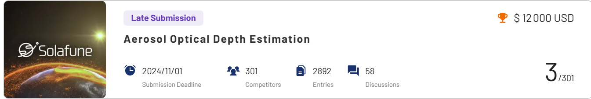
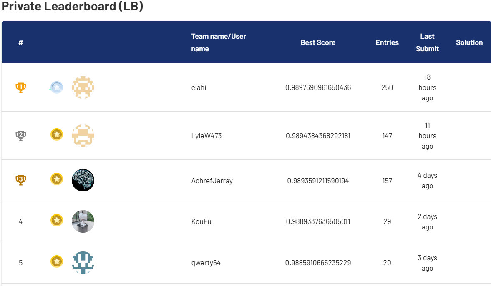

# Aerosol Optical Depth Estimation - Solafune Challenge (3rd Place Solution)

This repository contains the code and documentation for my third-place solution in the **Aerosol Optical Depth** (AOD) Estimation Challenge organized by **Solafune**,
Inc. The challenge involved estimating aerosol optical depth from **Sentinel-2 multispectral images**, a crucial metric for understanding air quality, 
public health, and climate change.

## Overview

The goal of this project was to accurately estimate Aerosol Optical Depth (AOD) using the Sentinel-2 satellite images with **13 spectral bands**. 
These measurements aid in advancing environmental monitoring methodologies, with applications in **air quality** assessment and **climate** research.

## The dataset consists of:

**Sentinel-2 Images**: 13 spectral bands (B1 to B12, including B8A), processed to mask clouds and covering the period from January 1, 2016, to May 1, 2024.
**AERONET Dataset**: Provides AOD measurements from various global locations, processed using the Angstrom interpolation to estimate AOD at 550nm from measurements at 500nm and 675nm.

## AOD estimation is critical for:

1. ***Public Health**: Monitoring air quality and pollution levels.*
2. ***Climate Research**: Understanding the role of aerosols in climate change.*
3. ***Weather Forecasting**: Improving the accuracy of meteorological predictions.*
    
## Results
1. *Final Standing: **3rd Place**.*
2. *Accuracy: Achieved a high accuracy of **0.9894** in AOD estimation.*
    
| results |
|------------------|
| |
| |

## Getting Started

1.***Clone the repository:***

    !git clone https://github.com/Achrefjr1997/OAD.git
    %cd OAD
    
2.***Install dependencies:***

    !pip install -r requirements.txt
    
3.***Download, prepare and training model:***

     !python train.py 
            
4.***Generate submission:***

     !python predict.py 

## Acknowledgments

This project was part of the Solafune AOD Estimation Challenge. Many thanks to the organizers, **Solafune, Inc.**, for facilitating this opportunity.

## License
This project is licensed under the MIT License. See the [LICENSE](LICENSE)  file for details.
